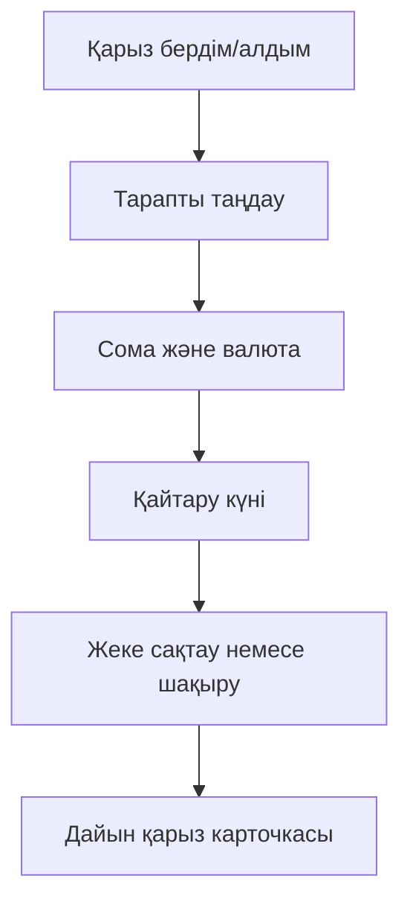
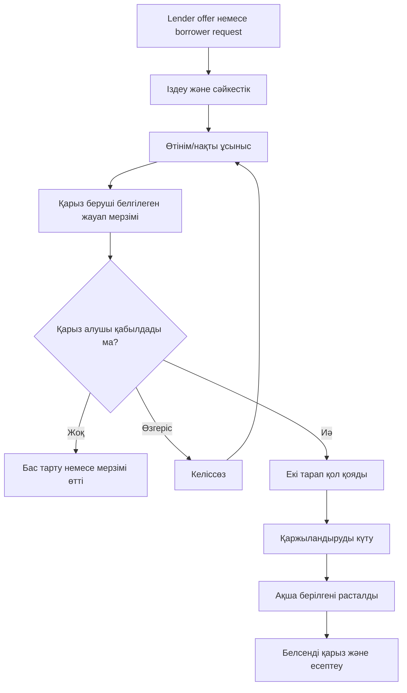
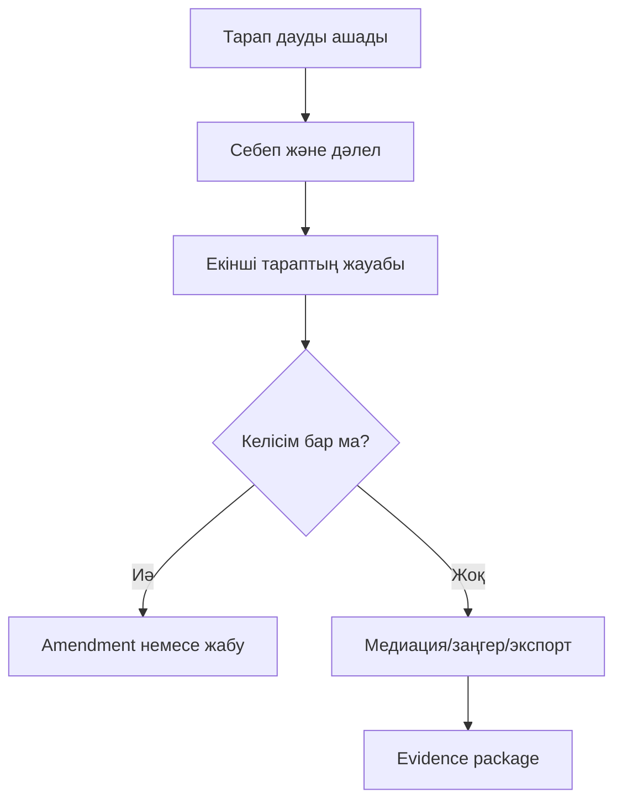
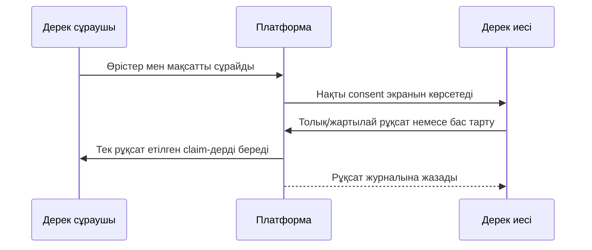
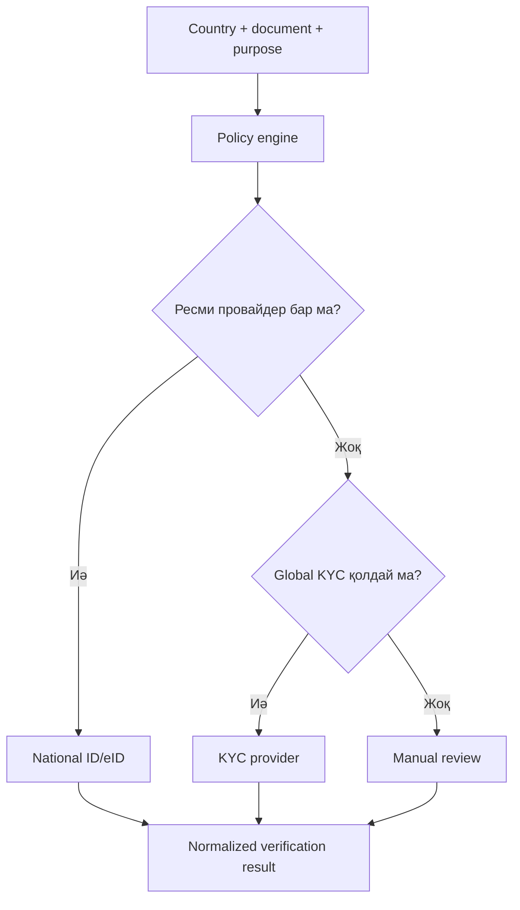
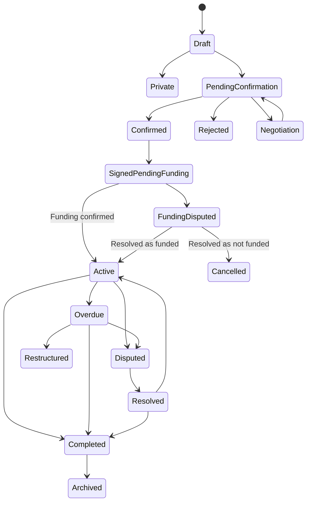
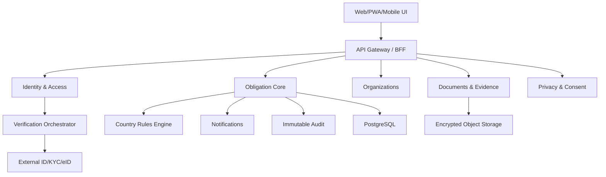
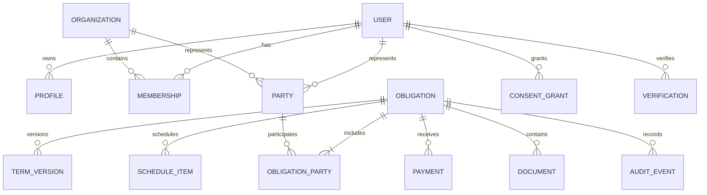
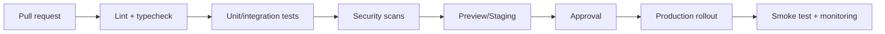

# QaryzLink — қарыз және міндеттемелерді басқару платформасы

## Толық техникалық тапсырма және даму концепциясы

**Нұсқа:** 1.3  
**Күйі:** өнім бағыты бекітілген master-specification  
**Жобаның жұмыс атауы:** QaryzLink  
**Бастапқы нарық:** Қазақстан  
**Кеңею бағыты:** халықаралық, country-pack архитектурасы  
**Бастапқы аудитория:** Қазақстандағы кәмелетке толған жеке тұлғалар  
**Өнім түрі:** банкке ұқсас басқару мүмкіндіктері бар privacy-first P2P debt and obligation platform  

> Бұл құжат өнімдік және техникалық талаптарды анықтайды. Ол заңгерлік қорытындыны алмастырмайды. Елдік шарттар, пайыздар, айыппұлдар, электрондық қолтаңба және өндіріп алу механизмдері іске қосылар алдында тиісті юрисдикция заңгерімен тексерілуі тиіс.

### Бренд позициясы

**QaryzLink** атауы қарыз беруші мен қарыз алушыны қауіпсіз цифрлық келісім арқылы байланыстыратын платформаны білдіреді.

- қысқа сипаттама: **Қарыз беруші мен қарыз алушы арасындағы келісім платформасы**;
- негізгі ұран: **Келістік. Растадық. Орындадық.**;
- балама ұран: **Қарызды келісіп басқар**;
- халықаралық descriptor: **Private lending and obligation management platform**;
- repository codename: `qaryzlink`;
- ұсынылатын өнім модульдері: `QaryzLink Personal`, `QaryzLink Business`, `QaryzLink Verify`, `QaryzLink Sign`.

Атау ресми банк, МҚҰ немесе кредиттік бюро мәртебесін білдірмейді. Коммерциялық іске қосар алдында Qazpatent, домендер, компания атаулары және қолданба дүкендері бойынша толық name clearance жүргізіледі.

---

## 1. Жобаның мақсаты

Платформаның бірінші мақсаты — Қазақстандағы жеке тұлғаларға бір-біріне қарызды банк өніміндегідей түсінікті есептеулермен, кестелермен, төлем тарихымен және бақылаумен рәсімдеуге мүмкіндік беру. Платформа өзі банк немесе МҚҰ болмайды; қарыздың тараптары — пайдаланушылардың өздері.

Платформа жеке тұлғаларға, ал кейін ұйымдарға өзара қарыздарды және басқа ақшалай міндеттемелерді:

- қарапайым түрде тіркеуге;
- екінші тараппен растауға;
- төлем кестесін жүргізуге;
- ақпаратты рұқсатпен бөлісуге;
- құжаттар мен төлем дәлелдерін сақтауға;
- өзгерістердің толық тарихын жүргізуге;
- қажет болғанда электрондық шартқа айналдыруға;
- болашақта заңдық, KYC/KYB, ЭЦҚ, банк, нотариус және медиация интеграцияларын қосуға

мүмкіндік береді.

Платформа бастапқы кезеңде несие беруші, банк, МҚҰ, төлем ұйымы немесе коллектор ретінде әрекет етпейді. Ол тараптардың өздері жасаған міндеттемелерді басқару және дәлелдерді ұйымдастыру құралы болады.

### 1.1 Негізгі өнімдік уәде

> Ауызша немесе чаттағы келісімді түсінікті, бақыланатын, рұқсатпен ортақ пайдаланылатын және қажет болса заңдық рәсімдеуге дайын міндеттемеге айналдыру.

### 1.2 Негізгі принциптер

1. **Simple first:** қарапайым қарызды 1–2 минутта жасау.
2. **Privacy by default:** барлық құпия ақпарат әдепкіде жабық.
3. **Progressive trust:** тексеру деңгейі қажеттілікке қарай көтеріледі.
4. **Mutual consent:** бір тараптың жазбасы автоматты түрде екінші тараптың мойындалған қарызы болмайды.
5. **Immutable history:** маңызды өзгерістер өшірілмейді, жаңа нұсқа ретінде сақталады.
6. **Country-aware:** азаматтық, резиденттік, құжат берген ел және шарт юрисдикциясы бөлек сақталады.
7. **Provider-independent:** KYC, қолтаңба, төлем және хабарлама провайдерлері ауыстырылатын болады.
8. **Legal-ready, not legal-by-claim:** жүйе заңдық дәлелдерді күшейтеді, бірақ сот нәтижесіне кепілдік бермейді.
9. **Law-based restrictions:** өнімдік құқықтық шектеулердің әрқайсысы нақты құқықтық негізбен және күшіне ену мерзімімен дәлелденеді.
10. **Future-compatible:** ұйымдар мен басқа елдер алғашқы UI-да толық ашылмаса да, domain model мен интеграциялық интерфейстер оларды қолдайды.

---

## 2. Өнім шекарасы

### 2.1 Бастапқы релизде платформа жасайды

- жеке және ұйымдық аккаунттарды жүргізеді;
- жеке қарыз жазбасын жасауға мүмкіндік береді;
- екінші тарапты сілтеме, email немесе телефон арқылы шақырады;
- міндеттемені растау, өзгеріс ұсыну немесе даулауға мүмкіндік береді;
- төлем кестесі мен қалдықты есептейді;
- төлем дәлелдерін тіркейді;
- еске салғыштар жібереді;
- privacy және consent параметрлерін басқарады;
- құжаттар мен әрекеттер тарихын сақтайды;
- PDF/ZIP evidence package экспортын дайындайды.

### 2.2 Бастапқы релизде платформа жасамайды

- өз ақшасынан қарыз бермейді;
- пайдаланушылардың ақшасын өз балансында ұстамайды;
- несие беру шешімін қабылдамайды;
- пайдаланушы орнына қарыз беру шешімін қабылдамайды немесе тараптарды келісімсіз автоматты байланыстырмайды;
- заңсыз пайызды немесе айыппұлды мақұлдамайды;
- қарызды күшпен өндірмейді;
- пайдаланушыны сотта автоматты түрде өкілдік етпейді;
- бір тараптың расталмаған шағымын ашық рейтингке шығармайды.

### 2.3 Кейін қосылатын мүмкіндіктер

- мемлекеттік Digital ID және ЭЦҚ;
- халықаралық KYC/KYB;
- банк және open banking интеграциялары;
- төлем initiation (лицензияланған серіктес арқылы);
- нотариус, медиатор және заңгер кабинеті;
- кредиттік бюро интеграциясы — тек құқықтық негіз және келісім болғанда;
- лицензияланған қаржы ұйымдарына white-label;
- елдік құқықтық шаблондар мен compliance rules.

### 2.4 «Банктегідей» басқару мүмкіндіктері

Бұл ұғым банктің мәртебесін немесе оның атынан қызмет көрсетуді білдірмейді. Ол пайдаланушыға кәсіби қаржы өніміндегідей түсінікті құралдар берілуін білдіреді:

- бір жолғы немесе бірнеше траншпен қарыз беру;
- пайызсыз қарыз;
- тұрақты пайыздық мөлшерлеме;
- аннуитеттік және тең негізгі қарыз төлемдері;
- custom төлем кестесі;
- алғашқы төлем күні және grace period;
- негізгі қарыз, пайыз, комиссия және айыппұлды бөлек көрсету;
- жылдық тиімді мөлшерлемені ақпараттық есептеу;
- мерзімінен бұрын толық немесе ішінара өтеу;
- қайта есептеу және жаңа кестені екі тараппен растау;
- payment holiday немесе мерзімді ұзарту туралы amendment;
- overdue және күндер саны;
- әр төлемнің негізгі қарыз/пайызға бөлінуі;
- account statement және reconciliation;
- автоматты reminder және push/email/SMS;
- қарызды қайта құрылымдау;
- толық жабу анықтамасы;
- есептеудің түсінікті breakdown-ы және формула нұсқасы.

Комиссия, айыппұл, автоматты есептен шығару және кейбір пайыздық модельдер тек олардың нақты құқықтық негізі бекітілгенде қосылады. Платформа өздігінен міндетті сақтандыру, жасырын комиссия немесе алдын ала таңдалған ақылы қызмет қоспайды.

### 2.5 Нарықтық кезеңдер

1. **KZ Personal:** Қазақстандағы жеке тұлғалар арасындағы қарыз.
2. **KZ Professional:** күрделі кестелер, күшейтілген identity және legal evidence.
3. **KZ Business:** жеке кәсіпкерлер мен заңды тұлғалар.
4. **Country Expansion:** әр елге жеке құқықтық және техникалық country pack.

Ұйымдар мен халықаралық мүмкіндіктер алғашқы release-тің қолданушы интерфейсін ауырлатпайды, бірақ деректер моделі, tenant isolation, валюта, локализация және provider adapter-лері басынан дайын болады.

### 2.6 Платформаның делдалдық шекарасы

Платформа бастапқыда ақпараттық және техникалық көмекші болады:

- пайдаланушыларды ID, шақыру немесе ашық талаптар арқылы табуға көмектеседі;
- талаптарды салыстырады және сәйкестік көрсетеді;
- шартты, кестені және дәлелдерді дайындайды;
- шешімді пайдаланушының орнына қабылдамайды;
- қарыздың тәуекелін өз балансына алмайды;
- бастапқы кезеңде ақша қабылдамайды, сақтамайды және аудармайды;
- тараптардың міндеттемесін өз атына алмайды;
- қарыз қайтарылатынына кепілдік бермейді.

Ашық ұсыныстар мен іздеу техникалық тұрғыдан feature flag артында дайындалады. Қазақстанда мұндай matching моделі платформаның құқықтық мәртебесіне әсер етпейтіні заңгерлік қорытындымен расталғаннан кейін ғана production-да ашылады.

---

## 3. Пайдаланушы түрлері

| Рөл | Сипаттама | Негізгі мүмкіндіктер |
|---|---|---|
| Guest | Тіркелмеген шақырылған адам | Шақыруды қарау, тіркелу |
| Individual | Жеке тұлға | Қарыз беру/алу, профиль, төлемдер |
| Organization owner | Ұйым иесі | Ұйым, рөлдер, саясаттар, billing |
| Organization member | Қызметкер | Рөліне сай міндеттемелермен жұмыс |
| Approver | Келісуші тұлға | Шартты тексеру және мақұлдау |
| Signatory | Қол қоюға уәкілетті тұлға | Ұйым атынан қол қою |
| Accountant | Бухгалтер | Төлемдер, салыстыру, есептер |
| Lawyer | Заңгер | Шаблондар, шарттар, dispute пакет |
| Auditor | Аудитор | Read-only audit қолжетімділігі |
| Mediator | Болашақ рөл | Дауды келісіммен шешу |
| Support agent | Платформа қызметкері | Шектеулі және журналданатын қолдау |
| Compliance officer | Ішкі бақылау | KYC/KYB және қауіп оқиғалары |
| System admin | Техникалық әкімші | Инфрақұрылым; құпия дерекке әдепкі қолжетімділігі жоқ |

### 3.1 Тарап түрлері

- жеке тұлға;
- жеке кәсіпкер;
- заңды тұлға;
- ұйым бөлімшесі;
- сенімхат бойынша өкіл;
- кепілгер;
- бірнеше кредитор немесе бірнеше борышкер.

---

## 4. Құқықтық және сенім деңгейлері

| Деңгей | Атауы | Растау | Қолданылуы |
|---|---|---|---|
| A0 | Private note | Бір тарап қана | Жеке есеп |
| A1 | Shared record | Екінші тарап көрді | Ортақ ақпарат |
| A2 | Mutually confirmed | Екі тарап нақты нұсқаны растады | Қарапайым міндеттеме |
| A3 | Identity verified | Құжат/selfie/Digital ID | Күшейтілген дәлел |
| A4 | Electronically signed | OTP/advanced signature | Электрондық келісім |
| A5 | Qualified/legal signature | Елге танылған ЭЦҚ/QES | Жоғары заңдық сенім |
| A6 | Notarial/regulated | Нотариус немесе реттелетін арна | Арнайы жағдайлар |

Жүйе ешқашан A0 жазбасын A2 немесе A5 деп көрсетпеуі тиіс. Әр экранда ағымдағы деңгей және оны көтеру жолы түсіндіріледі.

---

## 5. Негізгі пайдаланушы сценарийлері

### 5.1 Жылдам жеке қарыз



Минималды өрістер:

- бағыт: бердім немесе алдым;
- екінші тараптың аты/никнеймі;
- сома;
- валюта;
- берілген күн;
- қайтару күні немесе «мерзімсіз»;
- жеке жазба немесе растауға жіберу.

### 5.2 Тараптарды табу тәсілдері

Пайдаланушылар бір-бірін төрт жолмен таба алады:

1. **Public User ID:** нақты пайдаланушының тұрақты немесе бөлісуге арналған ID-ы бойынша.
2. **Private invitation:** телефон, email, QR немесе уақытша сілтеме арқылы.
3. **Lender offer:** қарыз беруші ашық талап жариялайды, қарыз алушы өтінім береді.
4. **Borrower request:** қарыз алушы өзіне қажетті шарттарды жариялайды, қарыз берушілер нақты ұсыныс береді.

Іздеу нәтижесінде құпия профиль деректері көрсетілмейді. Public ID random/enumeration-resistant болуы, пайдаланушы іздеуден толық жасырынуы және шақыруларды кімнен қабылдайтынын таңдауы тиіс.

### 5.3 Қарыз берушінің ашық ұсынысы

Қарыз беруші мыналарды анықтайды:

- ұсыныс атауы және қысқа сипаттамасы;
- қолжетімді сома диапазоны;
- валюта;
- пайыз және есептеу әдісі;
- мерзім диапазоны;
- төлем кестесі түрлері;
- grace period және мерзімінен бұрын өтеу ережесі;
- кепіл/кепілгер талабы;
- қарыз алушыдан сұралатын verification деңгейі мен құжаттар;
- кімдерге көрінетіні;
- өтінімге жауап беру мерзімі;
- ұсыныстың жалпы жарамдылық мерзімі;
- бір уақытта қабылданатын өтінімдер лимиті.

Қарыз алушы өтінім береді, бірақ ұсыныс оны автоматты түрде қарыз алуға міндеттемейді. Қарыз беруші өтінімді қабылдағаннан кейін нақты contract offer жасалады және екі тарап оған бөлек қол қояды.

### 5.4 Қарыз алушының ашық сұранысы

Қарыз алушы іздеу үшін қалаған параметрлерді жариялайды:

- қажетті сома және валюта;
- қалаған мерзім;
- қолайлы төлем көлемі/жиілігі;
- ең жоғары қалаған пайыз;
- қаражат қажет болатын күн;
- бере алатын verification/кепіл түрлері;
- сұраныстың көріну деңгейі және жарамдылық мерзімі.

Бұл параметрлер шарттың талаптары болып саналмайды. Олар matching/filtering үшін ғана қолданылады. Қарыз беруші өзінің нақты талаптарын ұсынады; заңға сай және екі тарап қол қойған соңғы lender offer ғана шартқа негіз болады.

Қарыз алушы әр ұсынысты қабылдауға, бас тартуға немесе келіссөзге жіберуге құқылы. «Қарыз берушінің талаптары есептеледі» қағидасы қарыз алушының саналы әрі айқын келісімін жоймайды.

### 5.5 Ұсыныс және келіссөз ағыны



Жауап мерзімін қарыз беруші анықтайды. Мерзім біткенде ұсыныс автоматты түрде `EXPIRED` күйіне өтеді; оны қайта ашу жаңа нұсқа және жаңа келісімді талап етеді.

### 5.6 Шақыру және өзара растау

1. Инициатор міндеттеме жасайды.
2. Жүйе бір рет қолданылатын немесе мерзімі шектеулі сілтеме жасайды.
3. Екінші тарап шарттар мен сұралатын деректерді көреді.
4. Ол қабылдайды, өзгеріс ұсынады немесе бас тартады.
5. Қабылдау кезінде нақты нұсқаға байланысты confirmation event жазылады.
6. Екі тарапқа бірдей нұсқа көрінеді.

### 5.7 Қол қою, қаржыландыру және есептің басталуы

Екі тарап та соңғы шарт нұсқасына қол қойған кезде шарт `SIGNED_PENDING_FUNDING` күйіне өтеді. Бұл сәтте шарт бекітілген, бірақ қарыз берілді деп есептелмейді.

**Implementation note (MVP, 2026-09-21):** қазіргі backend contract draft және read-only retrieval flow-ды қолдайды. POST /api/v1/contracts/:id/sign мутациясы CONTRACT_SIGNING_ENABLED=false әдепкі мәнімен өшірулі және CONTRACT_SIGNING_DISABLED conflict қайтарады. Оны қосу legal, security және release review-ден кейін ғана мүмкін; бұл platform acknowledgement-ді qualified electronic signature деп жарияламайды.

Ақша берілгенін растау үшін:

1. қарыз беруші төлем фактісін және қажетті дәлелді енгізеді;
2. жүйе құжаттың уақытын, hash-ын және жүктеген тарапты сақтайды;
3. қарыз алушы ақшаны алғанын растайды немесе дауды ашады;
4. екі жақты растаудан кейін disbursement `CONFIRMED` болады;
5. пайыз және төлем кестесі шарттағы ереже бойынша расталған disbursement датасынан басталады.

Қолайлы бастапқы дәлелдер:

- банк аударымының түбіртегі/үзіндісі;
- қолма-қол ақша беру-алу актісі немесе қолхат;
- екі тарап қол қойған disbursement confirmation;
- кейін: банк API немесе лицензияланған төлем провайдерінің расталған операциясы.

Файлды бір тараптың жай жүктеуі ақша берілгенін автоматты растауға жеткіліксіз. Егер қарыз алушы растамаса, міндеттеме `FUNDING_DISPUTED` күйіне өтеді және қалыпты пайыз есебі басталмайды, егер кейін сот/медиатор шешімі немесе екі тараптың жаңа келісімі басқа күнді бекітпесе.

### 5.8 Төлем енгізу

1. Бір тарап төлем енгізеді.
2. Сома, валюта, күн, әдіс және дәлел тіркеледі.
3. Екінші тарапқа растау сұрауы жіберіледі.
4. Расталған соң қалдық қайта есептеледі.
5. Дау болса төлем `disputed` күйінде тұрады және баланс саясатқа сай көрсетіледі.

### 5.9 Шартты өзгерту

- бар нұсқа өзгертілмейді;
- amendment draft жасалады;
- айырмашылықтар екі тарапқа көрсетіледі;
- қажет тараптар растағаннан кейін жаңа нұсқа күшіне енеді;
- алдыңғы нұсқа архивте қалады.

### 5.10 Қарызды жабу

- барлық төлемдер расталады;
- пайыз/айыппұл есебі бекітіледі;
- екі тарап closing statement қарайды;
- жабу расталады;
- closure certificate жасалады;
- міндеттеме read-only архивке өтеді.

### 5.11 Дау



Платформа дауды өзі шешпейді; келіссөзді және дәлелдерді ұйымдастырады.

---

## 6. Privacy және рұқсат моделі

### 6.1 Дерек көріну деңгейлері

| Деңгей | Кім көреді |
|---|---|
| PRIVATE | Тек иесі және заңды негізі бар жүйелік процесс |
| RELATIONSHIP | Нақты байланыстағы тараптар |
| SELECTED | Иесі таңдаған пайдаланушылар/ұйымдар |
| ORGANIZATION | Ұйым ішіндегі рұқсат етілген рөлдер |
| PUBLIC | Иесі әдейі жариялаған ақпарат |

### 6.2 Жеке бас ұғымдарын бөлу

- **Platform identity:** платформаның тексерілген нақты тұлғасы.
- **Counterparty identity:** нақты қатынас ішінде ашылған деректер.
- **Public identity:** никнейм, аватар және жария статистика.

Тексерілген адам контрагентке псевдониммен көрінуі мүмкін, бірақ заңдық деңгейге өткенде міндетті деректерді ашу сұралады.

### 6.3 Field-level consent

Әр рұқсатта мыналар сақталады:

- дерек субъектісі;
- дерек алушы;
- ашылатын өрістер;
- мақсат;
- құқықтық негіз немесе consent;
- қатысты міндеттеме;
- басталу және аяқталу уақыты;
- жүктеп алу/қайта бөлісу құқығы;
- рұқсаттың қайтарылған уақыты;
- consent мәтінінің нұсқасы.

### 6.4 Рұқсат ағыны



### 6.5 Жою және сақтау

- профильдік деректер пайдаланушы сұрауымен жойылады;
- аналитикалық дерек жойылады немесе қайтымсыз анонимдендіріледі;
- белсенді шарттың дәлелдері бір тараптың талабымен үнсіз жойылмайды;
- заңдық сақтау негізі болса, дерек restricted archive-қа өтеді;
- пайдаланушыға не жойылғаны, не сақталғаны және себебі көрсетіледі;
- retention policy елге және дерек түріне байланысты конфигурацияланады.

### 6.6 Ашық ақпарат

Әдепкіде жабық. Пайдаланушы мынаны жариялай алады:

- никнейм және аватар;
- identity verified белгісі;
- жүйеде тіркелу уақыты;
- орындалған міндеттемелер саны;
- уақытында орындалу пайызы;
- ұйымның саласы және ресми ашық деректері.

Жариялауға болмайтын немесе қатаң бақылауды қажет ететін ақпарат:

- ЖСН/БСН-ның құпия қолданылатын бөліктері;
- паспорт/құжат нөмірі және көшірмесі;
- банк реквизиттері;
- толық мекенжай;
- екінші тараптың келісімінсіз нақты қарыз сомасы;
- расталмаған «қарызын төлемейді» айыптауы.

---

## 7. Identity Verification Orchestrator

### 7.1 Елдік атрибуттар

Бөлек сақталады:

- citizenship countries (бірнеше болуы мүмкін);
- residence country;
- tax residence;
- document issuing country;
- current location — тек нақты мақсат болғанда;
- contract governing law;
- dispute jurisdiction.

### 7.2 Тексеру деңгейлері

| Level | Әдіс | Мысал қолдану |
|---|---|---|
| L0 | Тексерілмеген | Жеке draft |
| L1 | Email/телефон | Ортақ қарапайым жазба |
| L2 | Құжат + liveness | Расталған жеке тұлға |
| L3 | Мемлекеттік ID/банк ID | Маңызды шарт |
| L4 | ЭЦҚ/QES | Заңдық қол қою |
| KYB | Компания + өкіл | Ұйымдық шарт |

### 7.3 Провайдер таңдау



### 7.4 Selective disclosure

Құжаттың өзін берудің орнына verified claims беріледі:

- тұлға расталған;
- аты шарттағы атпен сәйкес;
- 18 жастан үлкен;
- азаматтығы расталған;
- мекенжайы расталған;
- ұйым белсенді;
- қолданушы ұйым атынан қол қоюға өкілетті.

### 7.5 KYB

- ұйымның ресми атауы және тіркеу нөмірі;
- тіркелген ел және мекенжай;
- белсенділік мәртебесі;
- директорлар;
- ultimate beneficial owners;
- өкілдің өкілеттілігі;
- сенімхат және оның мерзімі;
- қажет болса AML/sanctions screening.

---

## 8. Міндеттемелер домені

Негізгі агрегат `Loan` емес, `Obligation` болады.

### 8.1 Міндеттеме түрлері

- personal loan;
- interest-free loan;
- interest-bearing loan;
- installment;
- deferred payment;
- trade receivable;
- advance;
- service debt;
- guarantee;
- secured obligation;
- custom obligation.

### 8.2 Негізгі күйлер



Шарттың қол қойылуы мен қарыз ақшасының нақты берілуі бөлек домендік оқиғалар. Негізгі қарыз және пайыздық есеп `FundingConfirmed` оқиғасынан кейін ғана басталады.

### 8.3 Ақша моделі

- сома integer minor units ретінде сақталады;
- валюта ISO 4217 коды арқылы;
- floating point қолданылмайды;
- әр есептеудің rounding policy-і сақталады;
- FX conversion бастапқыда ақпараттық қана;
- бастапқы сома, төленген сома және қалдық бөлек есептеледі;
- есеп формуласының нұсқасы сақталады.

### 8.4 Пайыз және айыппұл

- simple немесе compound interest;
- fixed немесе variable rate;
- annual/monthly/daily basis;
- grace period;
- late fee policy;
- cap және country-rule validation;
- calculation preview;
- әр кезең бойынша calculation breakdown;
- заңсыз немесе белгісіз шартқа warning/block/manual-review.

### 8.5 Ақша қозғалысының кезеңдері

**Бастапқы кезең:** ақша платформа сыртында беріледі; жүйе тек тараптар енгізген және растаған дәлелдерді сақтайды.

**Кейінгі кезең:** банк аударымы немесе лицензияланған үшінші тараптың есептік/эскроу шоты арқылы төлем. Бұл кезеңде платформа провайдердің транзакция ID-ын және мәртебесін алады, бірақ ақшаны өзінің операциялық шотында ұстамайды.

Үшінші тарап шоты интеграциясы тек төлем қызметі, escrow, KYC/AML, қайтарым, chargeback, қаражатты бөлу және лицензия талаптары бойынша жеке құқықтық/техникалық зерттеуден кейін іске қосылады.

---

## 9. Жоғары деңгейлі архитектура

Бастапқы архитектура — шекаралары анық модульдік монолит. Бұл MVP жылдамдығын сақтайды және кейін қажетті модульдерді бөлуге мүмкіндік береді.



### 9.1 Ұсынылатын стек

- Frontend: Next.js, TypeScript, PWA;
- Backend: NestJS, TypeScript;
- Database: PostgreSQL;
- ORM: Prisma немесе Drizzle — spike нәтижесімен таңдалады;
- Cache/queue: Redis + BullMQ;
- Object storage: S3-compatible encrypted storage;
- API: REST/OpenAPI, ішкі async events;
- Auth: OIDC/OAuth2-compatible provider немесе жеке модуль;
- Observability: OpenTelemetry + metrics/logs/traces;
- Error tracking: Sentry-compatible service;
- Deployment: Docker; бастапқы managed environment, кейін k3s/Kubernetes;
- CI/CD: GitHub Actions;
- Infrastructure as Code: Terraform/OpenTofu — production кезеңінде.

### 9.2 Негізгі модульдер

1. Identity and Authentication
2. Profiles
3. Organizations and Memberships
4. Relationships
5. Offers, Requests and Matching
6. Privacy and Consent
7. Identity Verification
8. Obligations
9. Contract Terms and Templates
10. Schedules and Calculations
11. Payments and Reconciliation
12. Documents and Evidence
13. Signatures
14. Amendments and Versioning
15. Disputes
16. Notifications
17. Country Rules
18. Audit
19. Reporting and Analytics
20. Billing
21. Administration and Compliance

### 9.3 Болашақта бөлінетін сервистер

- notification service;
- document/evidence service;
- verification orchestration;
- signature service;
- analytics pipeline;
- country rules service.

---

## 10. Деректер моделі

### 10.1 Негізгі байланыстар



### 10.2 Негізгі entities

#### User

- id;
- status;
- locale;
- timezone;
- createdAt;
- deletedAt;
- riskState.

#### IdentityVaultRecord

- userId;
- encrypted legal name;
- encrypted date of birth;
- encrypted national identifiers;
- citizenship list;
- residence and tax residence;
- key version;
- retention metadata.

#### Profile

- displayName;
- avatar;
- biography;
- visibility settings;
- public stats settings.

#### Party

Шартқа қатысушының абстракциясы:

- type: individual/organization;
- linked user/organization;
- display snapshot;
- verified claims;
- representation metadata.

#### Obligation

- id және public reference;
- type;
- status;
- assurance level;
- currency;
- principal;
- outstanding balance;
- governing law;
- jurisdiction;
- country pack version;
- active term version;
- createdBy және timestamps.

#### LenderOffer

- lender party;
- visibility және аудитория фильтрлері;
- amount/rate/term диапазондары;
- repayment және verification талаптары;
- response deadline policy;
- validity period;
- country rule result;
- version және status.

#### BorrowerRequest

- borrower party;
- desired amount/term/rate параметрлері;
- visibility;
- available verification/collateral claims;
- validity period;
- status.

#### ApplicationAndOffer

- source lender offer немесе borrower request;
- applicant және recipient;
- lender-defined нақты шарттар;
- response deadline;
- negotiation versions;
- accepted/rejected/expired status;
- converted obligation ID.

#### TermVersion

- immutable version number;
- structured terms JSON;
- rendered document hash;
- calculation policy version;
- effective date;
- confirmations/signatures.

#### Payment

- amount and currency;
- value date;
- method;
- payer/payee;
- status;
- evidence documents;
- confirmation events;
- external reference.

#### ConsentGrant

- subject;
- recipient;
- scope/fields;
- purpose;
- legal basis;
- obligation context;
- granted/revoked/expiry timestamps;
- policy text version.

#### AuditEvent

- actor;
- action;
- subject/resource;
- timestamp;
- request/session metadata;
- before/after hashes;
- correlation ID;
- append-only integrity chain.

---

## 11. API талаптары

### 11.1 API қағидалары

- versioned REST (`/api/v1`);
- OpenAPI specification;
- idempotency key — create/payment/signature операцияларында;
- cursor pagination;
- correlation ID;
- стандартты error contract;
- optimistic locking/version field;
- rate limiting;
- authorization әр resource деңгейінде;
- PII response filtering.

### 11.2 Негізгі endpoint топтары

```text
/auth
/users/me
/profiles
/organizations
/organizations/{id}/members
/relationships
/lender-offers
/borrower-requests
/applications
/matches
/consents
/verifications
/obligations
/obligations/{id}/parties
/obligations/{id}/terms
/obligations/{id}/schedule
/obligations/{id}/payments
/obligations/{id}/documents
/obligations/{id}/amendments
/obligations/{id}/signatures
/obligations/{id}/disputes
/obligations/{id}/evidence-export
/notifications
/country-rules
/audit
```

### 11.3 Webhooks

- verification.completed;
- signature.completed;
- payment.detected/confirmed;
- document.processed;
- notification.delivery_updated.

Webhook талаптары:

- signature verification;
- replay protection;
- idempotent processing;
- retry and dead-letter queue;
- payload versioning.

---

## 12. Қауіпсіздік талаптары

### 12.1 Authentication

- email/phone verification;
- MFA: TOTP/passkey, қажет болса SMS fallback;
- session/device management;
- suspicious login detection;
- short-lived access token және rotation;
- enterprise SSO кейін қосылады.

### 12.2 Authorization

- RBAC + relationship/resource-based ABAC;
- deny-by-default;
- ұйым және tenant isolation;
- қолдау қызметіне just-in-time access;
- төрт көз қағидасы — маңызды admin әрекеттерінде;
- барлық privileged әрекет audit-ке жазылады.

### 12.3 Encryption

- TLS барлық тасымалдауда;
- database және object storage encryption at rest;
- аса құпия PII-ға application-level envelope encryption;
- KMS және key rotation;
- secrets тек secret manager-де;
- production дерегі development ортаға көшірілмейді.

### 12.4 Қолданба қауіпсіздігі

- OWASP ASVS baseline;
- input validation және output encoding;
- CSRF/XSS/SQLi/SSRF қорғауы;
- файлдарды malware scan;
- MIME және magic-byte validation;
- dependency және container scanning;
- SAST/DAST;
- rate limiting және abuse detection;
- тұрақты penetration test.

### 12.5 Audit integrity

- append-only event store;
- event hash chaining немесе WORM storage;
- trusted timestamp provider-ге кейін интеграция;
- admin event-ті update/delete ете алмайды;
- integrity verification job.

### 12.6 Backup және қалпына келтіру

- encrypted backups;
- point-in-time recovery;
- cross-zone copy;
- restoration drill;
- RPO/RTO production SLA-ға сай бекітіледі;
- backup retention country rules-пен басқарылады.

---

## 13. Құжаттар және evidence package

### 13.1 Құжат түрлері

- қарыз шарты;
- қолхат;
- қосымша келісім;
- төлем түбіртегі;
- банк аударымының дәлелі;
- чат скриншоты;
- сенімхат;
- кепіл құжаты;
- reconciliation act;
- closure certificate;
- dispute correspondence.

### 13.2 Evidence package құрамы

- current және previous contract versions;
- тараптардың verification claims-і;
- confirmation/signature events;
- төлемдер тізімі;
- құжаттар мен hash тізімі;
- notification delivery log;
- amendment тарихы;
- dispute history;
- audit timeline;
- machine-readable manifest;
- адам оқитын PDF summary.

Экспорттың өзі сотта автоматты жеңіс кепілдігі емес. Ол дәлелдерді бірізді және тексерілетін түрде жинайды.

---

## 14. Country Rules Engine

### 14.1 Country pack құрамы

- version және effective dates;
- қолданылатын міндеттеме түрлері;
- міндетті тарап деректері;
- рұқсат етілетін verification әдістері;
- signature assurance mapping;
- пайыз/айыппұл validation rules;
- consumer notices;
- contract templates;
- data residency және retention;
- dispute және jurisdiction параметрлері;
- legal review status;
- feature flags.

### 14.2 Rule нәтижелері

- `ALLOW` — рұқсат;
- `ALLOW_WITH_WARNING` — ескерту;
- `REQUIRE_VERIFICATION` — қосымша тексеру;
- `REQUIRE_LEGAL_REVIEW` — қолмен заңдық тексеру;
- `BLOCK` — платформада рәсімдеуге болмайды.

### 14.3 Шаблондар

- код ішінде hardcode жасалмайды;
- әр шаблон versioned;
- тілдер бөлек;
- заңгер бекіткен статус сақталады;
- шаблоннан жасалған құжат қай нұсқамен құрылғанын сақтайды;
- өзгерген заң бұрынғы қол қойылған құжатты қайта жазбайды.

### 14.4 Құқықтық шектеулерді басқару

Платформадағы әр құқықтық `WARNING`, `REQUIRE_*` немесе `BLOCK` ережесі дәлелденетін provenance-пен сақталуы тиіс:

- ел және юрисдикция;
- нормативтік актінің ресми атауы;
- ресми дереккөз URL-ы;
- бап/тармақ;
- түсіндірме және қолданылу шарты;
- жарияланған және күшіне енген күн;
- ереже күшін жоғалтатын күн, бар болса;
- заңгер тексерген тұлға және тексеру күні;
- rule version;
- соңғы қайта қарау күні;
- confidence/status: draft, reviewed, approved, superseded.

Заңдық негізі жоқ болжам пайдаланушы әрекетін бұғаттамауы тиіс: ол ақпараттық ұсыныс немесе manual review ретінде көрсетіледі. Дегенмен қауіпсіздік, fraud prevention, санкциялар, провайдер шарттары және техникалық тұтастыққа қатысты қорғаныс шектеулері бөлек саясат санаты болып есептеледі және өз rationale-ымен журналданады.

Заң өзгергенде:

1. жаңа rule version жарияланады;
2. effective date белгіленеді;
3. жаңа операцияларға жаңа нұсқа қолданылады;
4. бұрынғы шарттар ретроактивті өзгертілмейді, егер заң оны тікелей талап етпесе;
5. әсер ететін пайдаланушыларға түсінікті хабарлама жіберіледі;
6. migration және legal review нәтижесі audit-ке жазылады.

---

## 15. UX және экрандар

### 15.1 Негізгі навигация

- Басты бет;
- Міндеттемелер;
- Төлемдер;
- Байланыстар;
- Ұйымдар;
- Хабарламалар;
- Профиль және құпиялылық.

### 15.2 Міндетті экрандар

1. Onboarding және тіл таңдау
2. Телефон/email растау
3. Басты dashboard
4. «Қарыз бердім/алдым» quick flow
5. Advanced obligation builder
6. Контрагентті шақыру
7. Consent review
8. Міндеттеме detail
9. Schedule және timeline
10. Payment add/confirm/dispute
11. Documents
12. Amendment comparison
13. Verification center
14. Privacy center
15. Public profile preview
16. Organization workspace
17. Members, roles, approval workflow
18. Dispute center
19. Evidence export
20. Settings, sessions және data deletion

### 15.3 Progressive disclosure

- қарапайым flow-да заңдық терминдер минималды;
- advanced options бөлек ашылады;
- әр verification белгісінің түсіндірмесі бар;
- «растау» мен «қол қою» визуалды ажыратылады;
- қауіпті әрекетте plain-language summary беріледі;
- accessibility: WCAG 2.2 AA мақсат етіледі.

---

## 16. Хабарламалар

Арналар:

- in-app;
- email;
- push;
- SMS — маңызды және ақылы сценарийлер;
- мессенджер интеграциясы — кейін және келісіммен.

Оқиғалар:

- шақыру;
- растау/бас тарту;
- төлем мерзіміне дейін;
- төлем мерзімі келгенде;
- кешігу;
- төлем қосылды/расталды/дауланды;
- шарт өзгерісі;
- verification/signature нәтижесі;
- dispute update;
- security alert.

Талаптар:

- quiet hours және timezone;
- notification preference;
- заңдық хабарлама мен маркетингті бөлу;
- жеткізу мәртебесі;
- retry және provider fallback;
- sensitive data-ны notification body-ге шығармау.

---

## 17. Аналитика және статистика

### 17.1 Жеке аналитика

- берілген/алынған міндеттемелер;
- outstanding balance;
- алдағы төлемдер;
- overdue динамикасы;
- валюта бойынша бөліну;
- уақытында орындалу көрсеткіші.

### 17.2 Ұйымдық аналитика

- receivables aging;
- counterparty exposure;
- expected cash flow;
- overdue buckets;
- бөлім және менеджер бойынша;
- reconciliation status.

### 17.3 Public statistics

- тек opt-in;
- тек өзара расталған/тексерілген оқиғалар;
- жеке шарт пен контрагент ашылмайды;
- шағын топтарда re-identification болмас үшін suppression;
- дау кезіндегі көрсеткіштер саясатқа сай уақытша шығарылмайды;
- статистикаға апелляция механизмі болады.

---

## 18. Non-functional requirements

### 18.1 Өнімділік

- негізгі API p95 мақсаты: 500 ms-тан төмен, сыртқы интеграциясыз;
- негізгі бет LCP мақсаты: қолайлы mobile желіде 2.5 s-қа дейін;
- ауыр экспорттар background job;
- pagination міндетті;
- файл upload resumable болуы мүмкін.

### 18.2 Қолжетімділік

- MVP: 99.5% мақсат;
- production business: 99.9% мақсат;
- multi-zone deployment кейін;
- graceful degradation: KYC провайдері істемесе негізгі жеке жазба жұмысын жалғастырады.

### 18.3 Масштабталу

- stateless API;
- horizontal scaling;
- queues external integration үшін;
- read replica және partitioning қажеттілік туғанда;
- tenant-aware quotas.

### 18.4 Локализация

- бастапқы: қазақша және орысша;
- кейін: ағылшынша және полякша;
- мәтін кодтан бөлінеді;
- ақша/күн/сан locale бойынша;
- шарт тілі мен UI тілі бөлек болуы мүмкін.

---

## 19. Тестілеу стратегиясы

- unit tests: calculations, permissions, state transitions;
- property-based tests: пайыз және schedule формулалары;
- integration tests: DB, queue, storage;
- contract tests: сыртқы провайдер adapter-лері;
- E2E: critical user journeys;
- authorization matrix tests;
- tenant isolation tests;
- migration tests;
- security tests;
- accessibility tests;
- load tests;
- backup restore drill;
- country rules regression suite.

### 19.1 Міндетті acceptance сценарийлері

1. Бір тараптың private жазбасын басқа пайдаланушы көрмейді.
2. Consent берілмеген өріс API response-та қайтарылмайды.
3. Қарыз алушы растамаған қарыз «confirmed» болмайды.
4. Екі тарап растаған нұсқа үнсіз өзгермейді.
5. Бір tenant екіншісінің дерегіне қол жеткізе алмайды.
6. Бір webhook екі рет келсе, төлем екі рет құрылмайды.
7. Admin audit event-ті өшіре алмайды.
8. Account deletion заңдық retention-ды дұрыс ажыратады.
9. Provider істемесе verification retry/manual-review-ға өтеді.
10. Country rule бұзылған шарт блокталады немесе ескерту алады.

---

## 20. DevOps және орталар

Орталар:

- local/dev;
- automated test;
- staging;
- production;
- қажет болса country-specific production.

Pipeline:



Талаптар:

- protected main branch;
- required reviews;
- signed/reproducible releases мүмкіндігін қарастыру;
- database migration backward-compatible;
- canary немесе blue-green кейін;
- rollback runbook;
- secrets repository-ге түспейді;
- production access least privilege.

---

## 21. Codex және Claude жұмыс тәртібі

### 21.1 Branch моделі

- `main` — production-ready;
- `develop` — интеграция;
- `codex/<task>`;
- `claude/<task>`;
- барлық өзгеріс PR арқылы;
- бір уақытта бір модульдің бір файлдарына екі агент өзгеріс енгізбейді.

### 21.2 Репозиторий құжаттары

```text
/AGENTS.md
/CLAUDE.md
/docs/PRODUCT.md
/docs/ARCHITECTURE.md
/docs/SECURITY.md
/docs/PRIVACY.md
/docs/COMPLIANCE.md
/docs/API.md
/docs/DATA_MODEL.md
/docs/BACKLOG.md
/docs/HANDOFF.md
/docs/adr/
```

### 21.3 Жауапкершілік бөлінісі

| Бағыт | Негізгі орындаушы | Тексеруші |
|---|---|---|
| Архитектура және domain model | Codex | Claude/адам |
| Backend critical logic | Codex | Claude/адам |
| UI және frontend flows | Claude | Codex/адам |
| Privacy/authorization tests | Codex | адам |
| UI states/Storybook | Claude | Codex |
| CI/CD және migrations | Codex | адам |
| Құжаттама/handoff | Екеуі | адам |

Адамның міндетті review аймақтары: құқықтық мәтіндер, қауіпсіздік саясаты, production secrets, төлемдер, identity verification және деректерді жою.

---

## 22. Даму кезеңдері

### Phase 0 — Discovery және құқықтық шекара

- product scope;
- Қазақстандағы құқықтық memo;
- privacy/data map;
- threat model;
- UX prototype;
- provider feasibility spike;
- архитектуралық шешімдер.

**Exit criteria:** іске қосуға болатын және лицензия талап етпейтін MVP шекарасы бекітілген.

### Phase 1 — Foundation

- monorepo/repositories;
- auth және sessions;
- profile/privacy;
- organizations skeleton;
- consent service;
- audit;
- localization;
- CI/CD және environments.

### Phase 2 — Personal MVP

- quick loan;
- invite және mutual confirmation;
- schedule;
- manual payments;
- attachments;
- reminders;
- dashboard;
- closure;
- basic export.

### Phase 3 — Trust және evidence

- identity provider adapter;
- document/liveness KYC;
- evidence package;
- contract versioning;
- amendments;
- dispute flow;
- privacy center және deletion workflow.

### Phase 4 — Business

- organizations толық моделі;
- roles and permissions;
- approval workflow;
- signatory authority;
- receivables analytics;
- API/webhooks;
- bulk import/export.

### Phase 5 — Legal-ready Kazakhstan

- заңгер бекіткен country pack;
- ЭЦҚ/Digital ID feasibility және integration;
- legal notices;
- нотариус/медиация процесі;
- retention policy;
- compliance audit.

### Phase 6 — International

- English/Polish;
- EU privacy/eIDAS readiness;
- әр елге legal review;
- data region selection;
- local providers;
- local company/representative requirements.

---

## 23. Толықтыруды қажет ететін шешімдер

Келесі сұрақтар discovery кезеңінде нақты бекітілуі тиіс:

### Бизнес

- өнімнің атауы және бренд позициясы;
- кім бірінші төлем жасайтын аудитория: жеке адам ба, шағын бизнес пе;
- subscription, per-contract немесе freemium моделі;
- тегін жоспардың лимиттері;
- платформа тек Қазақстанда қай уақытта іске қосылады;
- support және dispute response SLA.

### Құқықтық

- Қазақстандағы MVP-ге нақты legal opinion;
- пайдаланушы келісімі және privacy policy;
- data controller/processor рөлдері;
- деректерді сақтау мерзімдері;
- әр міндеттеме түріне міндетті реквизиттер;
- электрондық растау мен ЭЦҚ арасындағы шекара;
- халықаралық transfer механизмі;
- minors және capacity саясаты.

### Техникалық

- monorepo немесе бөлек repos;
- managed cloud және region;
- auth provider;
- KYC provider comparison;
- signature provider;
- SMS/email/push provider;
- document rendering engine;
- immutable audit implementation;
- object storage және KMS;
- analytics stack.

### Өнімдік қауіптер

- жалған қарыз жасау;
- біреуге қысым көрсету;
- ұрланған аккаунт арқылы растау;
- жалған құжат және deepfake;
- public reputation abuse;
- заңсыз пайыз;
- бір адамның бірнеше аккаунты;
- spam invitations;
- organization representative fraud;
- дәлелдерді платформадан тыс өзгерту.

---

## 24. MVP acceptance criteria

MVP дайын деп есептеледі, егер:

1. Пайдаланушы 2 минут ішінде private debt жасай алады.
2. Екінші тарап қауіпсіз сілтемемен кіріп, нақты шарттарды растай алады.
3. Расталмаған және расталған міндеттемелер анық ажыратылады.
4. Төлем кестесі мен қалдық дұрыс есептеледі.
5. Екі тарап төлемді растауға немесе даулауға қабілетті.
6. Әр маңызды әрекет audit log-қа түседі.
7. Пайдаланушы әр профиль өрісінің көрінуін басқарады.
8. Consent жоқ кезде құпия өрістер UI/API-да көрінбейді.
9. Құжаттар шифрланған storage-да және signed URL арқылы беріледі.
10. Account deletion және legal retention бөлек жұмыс істейді.
11. Қазақша және орысша негізгі flow толық аяқталады.
12. Critical E2E, authorization және tenant isolation тесттері өтеді.
13. Backup қалпына келтіру сынағы орындалған.
14. Security review-де critical/high ашық осалдық жоқ.
15. Evidence PDF негізгі оқиғаларды дұрыс көрсетеді.

---

## 25. Ұсынылатын бірінші release scope

Алғашқы production release үшін ең дұрыс жиынтық:

- Қазақстан;
- тек кәмелетке толған жеке тұлғалар;
- қазақша/орысша;
- private note және mutually confirmed debt;
- Public User ID және жеке шақыру арқылы іздеу;
- lender offer және borrower request деректер моделі;
- ашық matching production-да тек Қазақстан бойынша құқықтық қорытындыдан кейін feature flag арқылы;
- пайызсыз және заңгерлік тексеруден өткен simple fixed interest;
- аннуитеттік, тең негізгі қарыз және custom төлем кестесі;
- мерзімінен бұрын ішінара/толық өтеу және қайта есептеу;
- негізгі қарыз бен пайыздың жеке breakdown-ы;
- overdue есебі, statement және reconciliation;
- бір валютадағы міндеттеме;
- manual payment және receipt attachment;
- disbursement proof және екі тараптың funding confirmation-ы;
- phone/email identity L1;
- optional document verification L2;
- privacy/consent;
- reminders;
- amendments;
- closure certificate;
- basic evidence export;
- ұйымдарға тек preview/beta немесе келесі релиз.

Бұл scope қарапайым өнім шығаруға мүмкіндік береді, бірақ database, permissions, events және provider interfaces enterprise даму бағытына дайын болады.

---

## 26. Заңдық және нормативтік бастапқы сілтемелер

- Қазақстан Республикасының Азаматтық кодексі, қарыз шарты: https://adilet.zan.kz/kaz/docs/K990000409_/compare
- Қазақстан Республикасының «Дербес деректер және оларды қорғау туралы» заңы: https://adilet.zan.kz/kaz/docs/Z1300000094/links
- Микроқаржылық қызметті лицензиялау туралы ресми ақпарат: https://www.gov.kz/services/4491?lang=kk
- ЕО eIDAS Regulation: https://eur-lex.europa.eu/eli/reg/2014/910/oj/eng

Бұл тізім толық емес және implementation басталарда жаңартылуы тиіс.

---

## 27. Келесі практикалық қадамдар

1. Өнімнің уақытша атауын бекіту; бастапқы аудитория — Қазақстандағы жеке тұлғалар.
2. Қазақстандық заңгерге MVP scope бойынша нақты сұрақтар пакетін беру.
3. User flows және clickable prototype дайындау.
4. Threat model және privacy data map жасау.
5. KYC/ЭЦҚ провайдерлеріне feasibility зерттеу жүргізу.
6. Architecture Decision Records жазу.
7. Репозиторий, CI/CD және foundation модульдерін жасау.
8. Personal MVP-ді вертикалды slice түрінде іске асыру.
9. Security, usability және legal review өткізу.
10. Жабық beta-ға шығару, содан кейін Business және Legal-ready кезеңдеріне өту.

---

## Қысқа қорытынды

Өнім бірден ауыр қаржы платформасы ретінде емес, қарапайым қарызды басқару құралынан басталады. Бірақ оның негізгі объектісі `Obligation`, privacy моделі field-level consent, тарихы immutable, identity тексеруі provider-independent, ал құқықтық талаптары country-pack арқылы құрылады. Осы фундамент сақталса, өнімді жеке адамдарға арналған жеңіл сервистен ұйымдар арасындағы enterprise міндеттемелер платформасына дейін қайта жазбай дамытуға болады.
